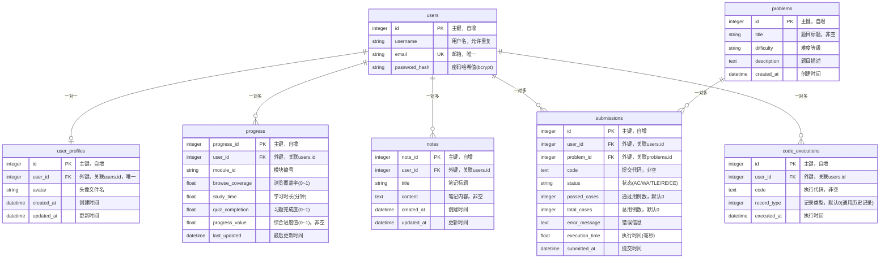

# 项目数据库ER图

本文档展示了整个项目的数据库实体关系图（ER Diagram），基于models目录下的所有模型定义。

## ER图



## 实体说明

### 1. users（用户表）
- **主键**：`id` (Integer, 自增)
- **唯一约束**：`email`
- **说明**：存储用户基本信息，包括用户名、邮箱和加密后的密码

### 2. user_profiles（用户配置表）
- **主键**：`id` (Integer, 自增)
- **外键**：`user_id` → `users.id` (唯一约束，一对一关系)
- **说明**：存储用户的个性化配置，如头像等

### 3. progress（学习进度表）
- **主键**：`progress_id` (Integer, 自增)
- **外键**：`user_id` → `users.id`
- **唯一约束**：`(user_id, module_id)` - 每个用户每个模块只有一条进度记录
- **说明**：记录用户在每个学习模块的学习进度，包括浏览覆盖率、学习时长、习题完成度等

### 4. notes（笔记表）
- **主键**：`note_id` (Integer, 自增)
- **外键**：`user_id` → `users.id`
- **说明**：存储用户的学习笔记，支持标题和内容

### 5. problems（题目表）
- **主键**：`id` (Integer, 自增)
- **说明**：存储OJ系统的题目信息，包括标题、难度、描述等

### 6. submissions（提交记录表）
- **主键**：`id` (Integer, 自增)
- **外键**：
  - `user_id` → `users.id`
  - `problem_id` → `problems.id`
- **说明**：记录用户对题目的代码提交，包括代码、状态、通过用例数、执行时间等

### 7. code_executions（代码执行历史表）
- **主键**：`id` (Integer, 自增)
- **外键**：`user_id` → `users.id`
- **说明**：记录用户在代码练习场执行的代码历史，支持自动管理（最多保留10条）

## 关系说明

### 一对一关系
- **users ↔ user_profiles**：每个用户有且仅有一个配置记录

### 一对多关系
- **users → progress**：一个用户可以有多个模块的学习进度记录
- **users → notes**：一个用户可以有多条笔记
- **users → submissions**：一个用户可以有多次代码提交
- **users → code_executions**：一个用户可以有多次代码执行记录
- **problems → submissions**：一道题目可以有多条提交记录

## 索引设计

### 主键索引
- 所有表都有自增主键作为聚集索引

### 唯一索引
- `users.email`：确保邮箱唯一性
- `user_profiles.user_id`：确保用户配置一对一关系
- `progress(user_id, module_id)`：确保每个用户每个模块只有一条进度记录

### 外键索引
- 所有外键字段自动创建索引，优化关联查询性能

## 数据完整性约束

1. **外键约束**：所有外键都设置了`nullable=False`，确保数据完整性
2. **唯一约束**：邮箱和用户配置的一对一关系通过唯一约束保证
3. **非空约束**：关键字段如用户名、邮箱、密码哈希等都设置了非空约束
4. **默认值**：时间字段、计数字段等都设置了合理的默认值

## 数据流关系

```
用户(User)
├── 用户配置(UserProfile) [1:1]
├── 学习进度(Progress) [1:N]
├── 学习笔记(Note) [1:N]
├── 代码提交(Submission) [1:N]
│   └── 关联题目(Problem) [N:1]
└── 代码执行历史(CodeExecution) [1:N]
```

## 设计特点

1. **用户中心设计**：所有业务数据都围绕`users`表展开
2. **模块化进度跟踪**：通过`progress`表实现细粒度的学习进度管理
3. **完整的OJ系统**：`problems`和`submissions`表支持完整的在线判题功能
4. **学习辅助功能**：`notes`和`code_executions`表支持笔记和代码执行历史
5. **数据一致性**：通过外键约束和唯一约束保证数据完整性

